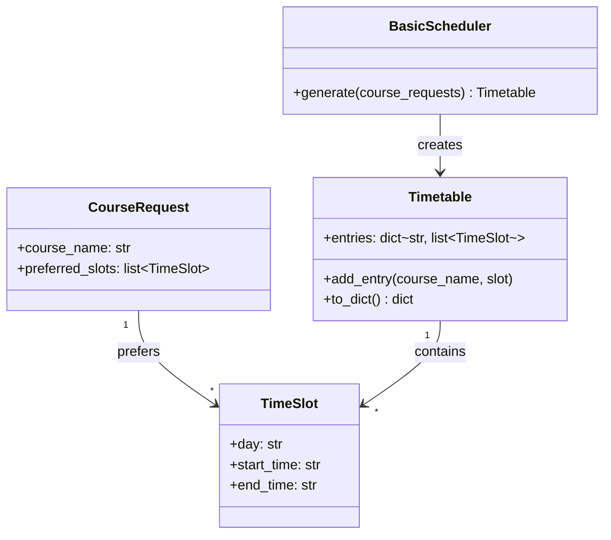

# UML Class Diagram

```mermaid
classDiagram
    class TimeSlot {
        +day: str
        +start_time: str
        +end_time: str
    }

    class CourseRequest {
        +course_name: str
        +preferred_slots: list~TimeSlot~
    }

    class Timetable {
        +entries: dict~str, list~TimeSlot~~
        +add_entry(course_name, slot)
        +to_dict() dict
    }

    class BasicScheduler {
        +generate(course_requests) Timetable
    }

    CourseRequest "1" --> "*" TimeSlot : prefers
    Timetable "1" --> "*" TimeSlot : contains
    BasicScheduler --> Timetable : creates
```
