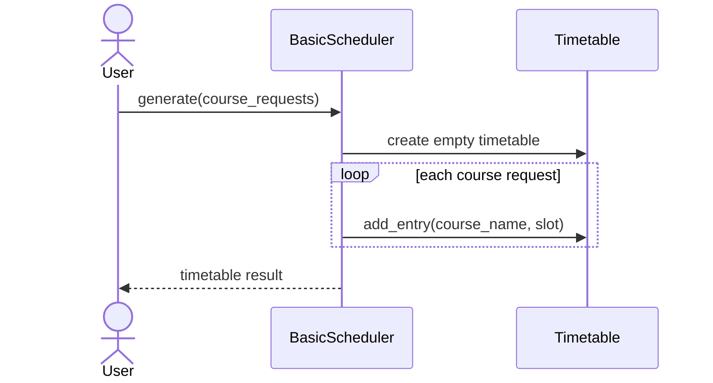

# UML Sequence Diagram

```mermaid
sequenceDiagram
    actor User
    participant Scheduler as BasicScheduler
    participant Table as Timetable

    User->>Scheduler: generate(course_requests)
    Scheduler->>Table: create empty timetable
    loop each course request
        Scheduler->>Table: add_entry(course_name, slot)
    end
    Scheduler-->>User: timetable result
```
